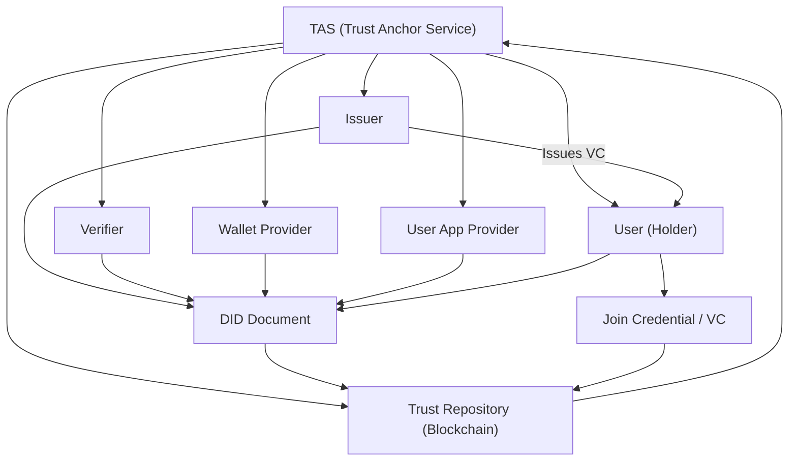
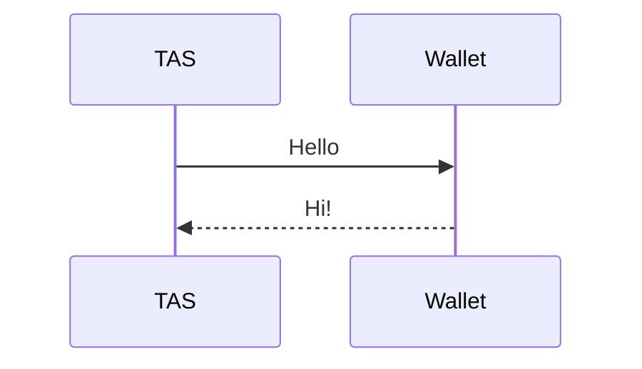
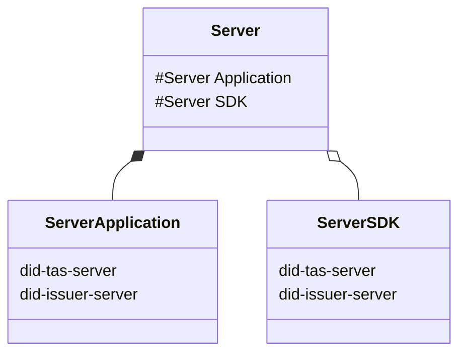
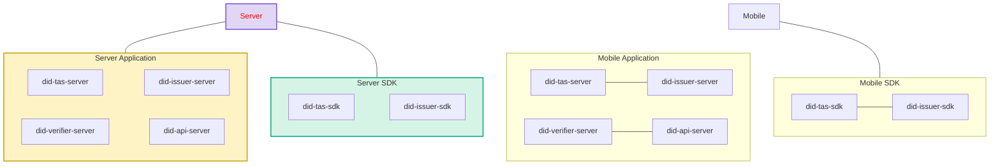
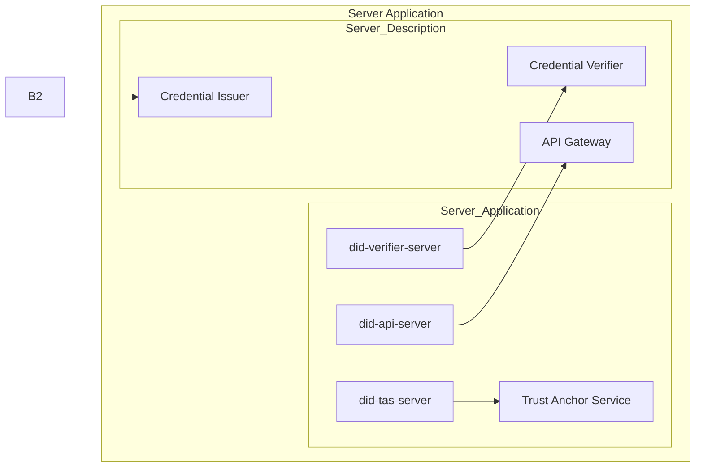
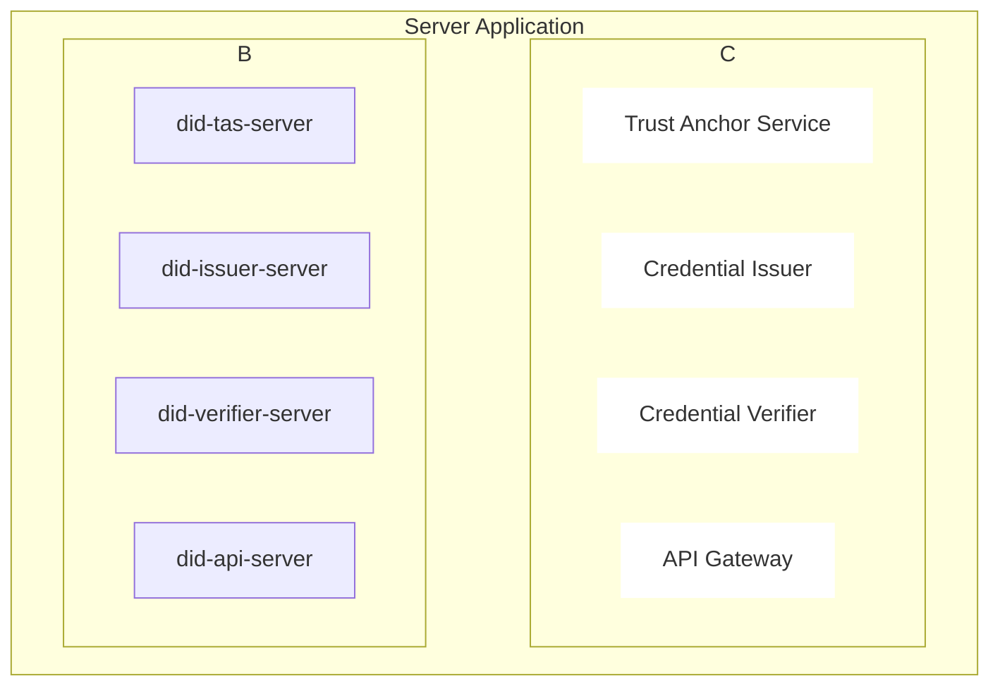
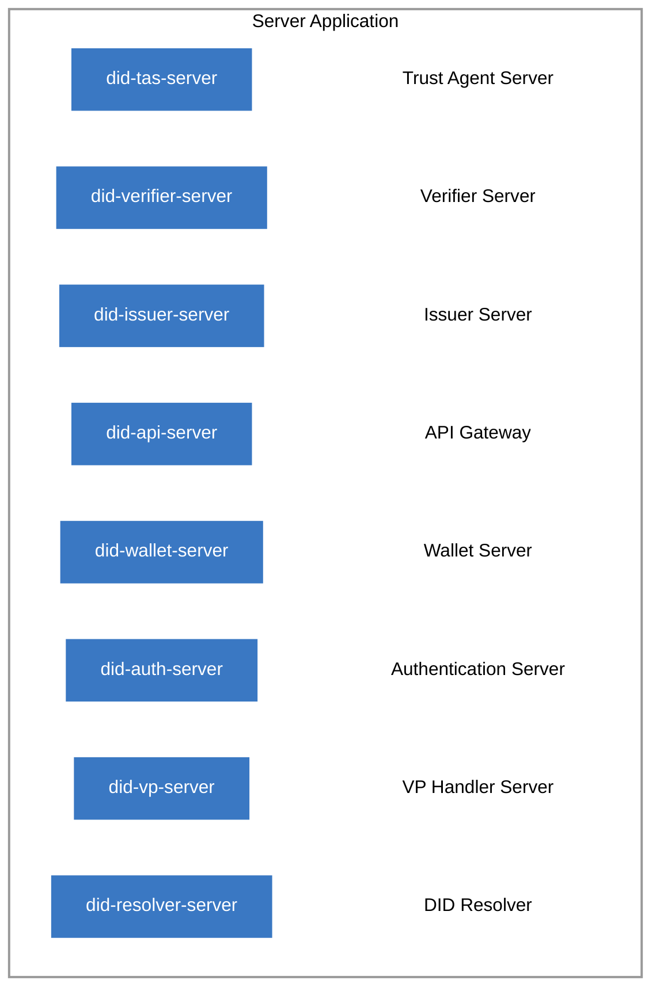
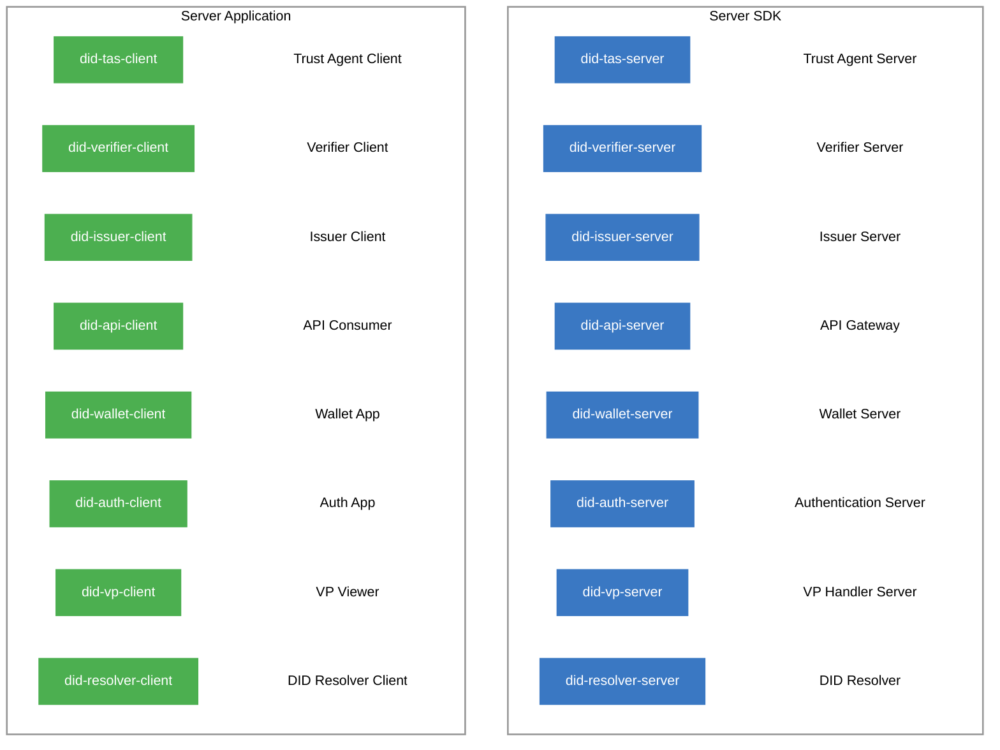

```mermaid
graph TD

    TAS["TAS (Trust Anchor Service)"]
    Issuer["Issuer"]
    Verifier["Verifier"]
    Wallet["Wallet Provider"]
    App["User App Provider"]
    User["User (Holder)"]
    Blockchain["Trust Repository (Blockchain)"]

    DIDDoc["DID Document"]
    Credential["Join Credential / VC"]

    %% 관계 구성
    Blockchain --> TAS
    TAS --> Blockchain

    TAS --> Issuer
    TAS --> Verifier
    TAS --> Wallet
    TAS --> App
    TAS --> User

    Issuer --> DIDDoc
    Verifier --> DIDDoc
    Wallet --> DIDDoc
    App --> DIDDoc
    User --> DIDDoc

    DIDDoc --> Blockchain
    Credential --> Blockchain

    Issuer -->|Issues VC| User
    User --> Credential
```

```mermaid
sequenceDiagram
    participant TAS
    participant Wallet
    TAS->>Wallet: Hello
    Wallet-->>TAS: Hi!
```

```mermaid
classDiagram
    class Server {
        #Server Application
        #Server SDK
    }
    class Server Application {
        did-tas-server
        did-issuer-server
    }
    class Server SDK {
        did-tas-server
        did-issuer-server
    }

    Server *-- Server Application
    Server o-- Server SDK
```

```mermaid
graph TD
    A[Server]
    M[Mobile]

    %% 두 개의 그룹을 만들고 내부 구성 요소 나열
    subgraph B[Server Application]
        B1[did-tas-server]
        B2[did-issuer-server]
        B3[did-verifier-server]
        B4[did-api-server]
    end

    subgraph C[Server SDK]
        C1[did-tas-sdk]
        C2[did-issuer-sdk]
    end

    subgraph O[Mobile Application]
        O1[did-tas-server]
        O2[did-issuer-server]
        O3[did-verifier-server]
        O4[did-api-server]
    end

    subgraph P[Mobile SDK]
        P1[did-tas-sdk]
        P2[did-issuer-sdk]
    end

    %% Server와 그룹 연결 (선은 투명 처리)
    A --- B
    A --- C

    %% 가짜 레이아웃용 선 (투명화)
    B1 --- B2
    B3 --- B4
    C1 --- C2

    %% Server와 그룹 연결 (선은 투명 처리)
    M --- O
    M --- P

    %% 가짜 레이아웃용 선 (투명화)
    O1 --- O2
    O3 --- O4
    P1 --- P2

    style A fill:#e0d7f5,stroke:#7a4fcf,stroke-width:2px,color:#ff0000
    style B fill:#fdf3c4,stroke:#c2a000,stroke-width:2px
    style C fill:#d5f4e6,stroke:#00a878,stroke-width:2px

    linkStyle 2,3,4,5 stroke-opacity:0
```

```mermaid
graph LR

subgraph A[Server Application]
    direction LR

    %% 왼쪽: Server Components (세로 정렬)
    subgraph B[Server_Application]
        direction TB
        B1[did-tas-server]
        C1["Trust Anchor Service"]
        B3[did-verifier-server]
        B4[did-api-server]
    end
    
    %% 오른쪽: 설명 (세로 정렬, 테두리 없음)
    subgraph C[Server_Description]
        direction TB
        C1["Trust Anchor Service"]
        C2["Credential Issuer"]
        C3["Credential Verifier"]
        C4["API Gateway"]
    end
end
    A --- B
    A --- C

%% 1:1 매핑
B1 --> C1
B2 --> C2
B3 --> C3
B4 --> C4

```

```mermaid
graph LR

subgraph A[Server Application]
    direction LR

    %% 왼쪽: Server Components
    subgraph B
        direction TB
        B1[did-tas-server]
        B2[did-issuer-server]
        B3[did-verifier-server]
        B4[did-api-server]
    end
    
    %% 오른쪽: 설명 (테두리 없음)
    subgraph C
        direction TB
        C1["Trust Anchor Service"]
        C2["Credential Issuer"]
        C3["Credential Verifier"]
        C4["API Gateway"]
    end
end

%% 투명 연결선
B1 --- C1
B2 --- C2
B3 --- C3
B4 --- C4

linkStyle 0,1,2,3 stroke-opacity:0

%% 설명 노드 테두리 제거
style C1 fill:#ffffff,stroke:transparent
style C2 fill:#ffffff,stroke:transparent
style C3 fill:#ffffff,stroke:transparent
style C4 fill:#ffffff,stroke:transparent

```

```mermaid
graph TD

    subgraph A[Server Application]
        direction LR
        B1[did-tas-server]
        C1[Trust Agent Server]
        B2[did-verifier-server]
        C2[Verifier Server]
        B3[did-issuer-server]
        C3[Issuer Server]
        B4[did-api-server]
        C4[API Gateway]
        B5[did-wallet-server]
        C5[Wallet Server]
        B6[did-auth-server]
        C6[Authentication Server]
        B7[did-vp-server]
        C7[VP Handler Server]
        B8[did-resolver-server]
        C8[DID Resolver]
    end

    %% 연결 관계
    B1 --- C1
    B2 --- C2
    B3 --- C3
    B4 --- C4
    B5 --- C5
    B6 --- C6
    B7 --- C7
    B8 --- C8

    %% 그룹 스타일
    style A fill:#ffffff,stroke:#999999,stroke-width:2px,color:#000000

    %% B 노드 스타일 (파란색 박스, 흰 글자)
    style B1 fill:#3a78c3,stroke:#3a78c3,stroke-width:1px,color:#ffffff
    style B2 fill:#3a78c3,stroke:#3a78c3,stroke-width:1px,color:#ffffff
    style B3 fill:#3a78c3,stroke:#3a78c3,stroke-width:1px,color:#ffffff
    style B4 fill:#3a78c3,stroke:#3a78c3,stroke-width:1px,color:#ffffff
    style B5 fill:#3a78c3,stroke:#3a78c3,stroke-width:1px,color:#ffffff
    style B6 fill:#3a78c3,stroke:#3a78c3,stroke-width:1px,color:#ffffff
    style B7 fill:#3a78c3,stroke:#3a78c3,stroke-width:1px,color:#ffffff
    style B8 fill:#3a78c3,stroke:#3a78c3,stroke-width:1px,color:#ffffff

    %% C 노드 스타일 (흰색 배경, 투명 테두리, 검은 글자)
    style C1 fill:#ffffff,stroke:transparent,color:#000000
    style C2 fill:#ffffff,stroke:transparent,color:#000000
    style C3 fill:#ffffff,stroke:transparent,color:#000000
    style C4 fill:#ffffff,stroke:transparent,color:#000000
    style C5 fill:#ffffff,stroke:transparent,color:#000000
    style C6 fill:#ffffff,stroke:transparent,color:#000000
    style C7 fill:#ffffff,stroke:transparent,color:#000000
    style C8 fill:#ffffff,stroke:transparent,color:#000000

    %% 연결선 투명 처리
    linkStyle 0,1,2,3,4,5,6,7 stroke-opacity:0


```

```mermaid
graph TD

    %% 왼쪽: Server SDK
    subgraph A[Server SDK]
        direction LR
        B1[did-tas-server]
        C1[Trust Agent Server]
        B2[did-verifier-server]
        C2[Verifier Server]
        B3[did-issuer-server]
        C3[Issuer Server]
        B4[did-api-server]
        C4[API Gateway]
        B5[did-wallet-server]
        C5[Wallet Server]
        B6[did-auth-server]
        C6[Authentication Server]
        B7[did-vp-server]
        C7[VP Handler Server]
        B8[did-resolver-server]
        C8[DID Resolver]
    end

    %% 오른쪽: Server Application
    subgraph B[Server Application]
        direction LR
        D1[did-tas-client]
        E1[Trust Agent Client]
        D2[did-verifier-client]
        E2[Verifier Client]
        D3[did-issuer-client]
        E3[Issuer Client]
        D4[did-api-client]
        E4[API Consumer]
        D5[did-wallet-client]
        E5[Wallet App]
        D6[did-auth-client]
        E6[Auth App]
        D7[did-vp-client]
        E7[VP Viewer]
        D8[did-resolver-client]
        E8[DID Resolver Client]
    end

    %% Server Application 연결 (투명)
    B1 --- C1
    B2 --- C2
    B3 --- C3
    B4 --- C4
    B5 --- C5
    B6 --- C6
    B7 --- C7
    B8 --- C8
    linkStyle 0,1,2,3,4,5,6,7 stroke-opacity:0

    %% Mobile Application 연결 (투명)
    D1 --- E1
    D2 --- E2
    D3 --- E3
    D4 --- E4
    D5 --- E5
    D6 --- E6
    D7 --- E7
    D8 --- E8
    linkStyle 8,9,10,11,12,13,14,15 stroke-opacity:0

    %% 스타일: 그룹
    style A fill:#ffffff,stroke:#999999,stroke-width:2px,color:#000000
    style B fill:#ffffff,stroke:#999999,stroke-width:2px,color:#000000

    %% 스타일: Server Application (파란색 박스)
    style B1 fill:#3a78c3,stroke:#3a78c3,color:#ffffff
    style B2 fill:#3a78c3,stroke:#3a78c3,color:#ffffff
    style B3 fill:#3a78c3,stroke:#3a78c3,color:#ffffff
    style B4 fill:#3a78c3,stroke:#3a78c3,color:#ffffff
    style B5 fill:#3a78c3,stroke:#3a78c3,color:#ffffff
    style B6 fill:#3a78c3,stroke:#3a78c3,color:#ffffff
    style B7 fill:#3a78c3,stroke:#3a78c3,color:#ffffff
    style B8 fill:#3a78c3,stroke:#3a78c3,color:#ffffff

    %% 스타일: Server 설명 (투명 테두리)
    style C1 fill:#ffffff,stroke:transparent,color:#000000
    style C2 fill:#ffffff,stroke:transparent,color:#000000
    style C3 fill:#ffffff,stroke:transparent,color:#000000
    style C4 fill:#ffffff,stroke:transparent,color:#000000
    style C5 fill:#ffffff,stroke:transparent,color:#000000
    style C6 fill:#ffffff,stroke:transparent,color:#000000
    style C7 fill:#ffffff,stroke:transparent,color:#000000
    style C8 fill:#ffffff,stroke:transparent,color:#000000

    %% 스타일: Mobile Application (초록색 박스)
    style D1 fill:#4caf50,stroke:#4caf50,color:#ffffff
    style D2 fill:#4caf50,stroke:#4caf50,color:#ffffff
    style D3 fill:#4caf50,stroke:#4caf50,color:#ffffff
    style D4 fill:#4caf50,stroke:#4caf50,color:#ffffff
    style D5 fill:#4caf50,stroke:#4caf50,color:#ffffff
    style D6 fill:#4caf50,stroke:#4caf50,color:#ffffff
    style D7 fill:#4caf50,stroke:#4caf50,color:#ffffff
    style D8 fill:#4caf50,stroke:#4caf50,color:#ffffff

    %% 스타일: Mobile 설명 (투명 테두리)
    style E1 fill:#ffffff,stroke:transparent,color:#000000
    style E2 fill:#ffffff,stroke:transparent,color:#000000
    style E3 fill:#ffffff,stroke:transparent,color:#000000
    style E4 fill:#ffffff,stroke:transparent,color:#000000
    style E5 fill:#ffffff,stroke:transparent,color:#000000
    style E6 fill:#ffffff,stroke:transparent,color:#000000
    style E7 fill:#ffffff,stroke:transparent,color:#000000
    style E8 fill:#ffffff,stroke:transparent,color:#000000
```

```mermaid
graph TD

%% 왼쪽 열: Server Application
subgraph A[Document]
    direction LR
    A1[did-tas-server]
    B1[did-issuer-server]
end

%% 가운데 열: Mobile SDK
subgraph C[Mobile SDK]
    direction LR
    D1[did-wallet-app]
    E1[did-auth-app]
end

%% 오른쪽 열: Mobile Application
subgraph F[Mobile Application]
    direction LR
    G1[Trust Anchor 설명]
    H1[Credential Issuer 설명]
end

%% 연결선 (투명 처리)
A1 --- B1
D1 --- E1
G1 --- H1

linkStyle 0,1,2 stroke-opacity:0

%% 전체 subgraph 스타일 (배경 흰색, 글자색 검정)
style A fill:#ffffff,stroke:#cccccc,color:#000000
style C fill:#ffffff,stroke:#cccccc,color:#000000
style F fill:#ffffff,stroke:#cccccc,color:#000000

%% 개별 노드 스타일
style A1 fill:#3a78c3,stroke:#3a78c3,stroke-width:1px,color:#ffffff
style B1 fill:#ffffff,stroke:#cccccc,color:#000000
style D1 fill:#3a78c3,stroke:#3a78c3,stroke-width:1px,color:#ffffff
style E1 fill:#ffffff,stroke:#cccccc,color:#000000
style G1 fill:#3a78c3,stroke:#3a78c3,stroke-width:1px,color:#ffffff
style H1 fill:#ffffff,stroke:#cccccc,color:#000000

```

```mermaid
graph TD

%% 상단: Server SDK & Server Application
subgraph A[Server SDK]
    direction LR
    B1[did-tas-server]
    C1[Trust Agent Server]
    B2[did-verifier-server]
    C2[Verifier Server]
    B3[did-issuer-server]
    C3[Issuer Server]
    B4[did-api-server]
    C4[API Gateway]
    B5[did-wallet-server]
    C5[Wallet Server]
    B6[did-auth-server]
    C6[Authentication Server]
    B7[did-vp-server]
    C7[VP Handler Server]
    B8[did-resolver-server]
    C8[DID Resolver]
end

subgraph B[Server Application]
    direction LR
    D1[did-tas-client]
    E1[Trust Agent Client]
    D2[did-verifier-client]
    E2[Verifier Client]
    D3[did-issuer-client]
    E3[Issuer Client]
    D4[did-api-client]
    E4[API Consumer]
    D5[did-wallet-client]
    E5[Wallet App]
    D6[did-auth-client]
    E6[Auth App]
    D7[did-vp-client]
    E7[VP Viewer]
    D8[did-resolver-client]
    E8[DID Resolver Client]
end

%% 하단: Document / Mobile SDK / Mobile Application
subgraph C[Document]
    direction LR
    F1[did-tas-server]
    G1[did-issuer-server]
end

subgraph D[Mobile SDK]
    direction LR
    H1[did-wallet-app]
    I1[did-auth-app]
end

subgraph E[Mobile Application]
    direction LR
    J1[Trust Anchor 설명]
    K1[Credential Issuer 설명]
end

%% 연결선 (투명 처리)
B1 --- C1
B2 --- C2
B3 --- C3
B4 --- C4
B5 --- C5
B6 --- C6
B7 --- C7
B8 --- C8
linkStyle 0,1,2,3,4,5,6,7 stroke-opacity:0

D1 --- E1
D2 --- E2
D3 --- E3
D4 --- E4
D5 --- E5
D6 --- E6
D7 --- E7
D8 --- E8
linkStyle 8,9,10,11,12,13,14,15 stroke-opacity:0

F1 --- G1
H1 --- I1
J1 --- K1
linkStyle 16,17,18 stroke-opacity:0

%% 스타일: 그룹 박스
style A fill:#ffffff,stroke:#999999,stroke-width:2px,color:#000000
style B fill:#ffffff,stroke:#999999,stroke-width:2px,color:#000000
style C fill:#ffffff,stroke:#cccccc,color:#000000
style D fill:#ffffff,stroke:#cccccc,color:#000000
style E fill:#ffffff,stroke:#cccccc,color:#000000

%% 스타일: Server SDK 박스
style B1 fill:#3a78c3,stroke:#3a78c3,color:#ffffff
style B2 fill:#3a78c3,stroke:#3a78c3,color:#ffffff
style B3 fill:#3a78c3,stroke:#3a78c3,color:#ffffff
style B4 fill:#3a78c3,stroke:#3a78c3,color:#ffffff
style B5 fill:#3a78c3,stroke:#3a78c3,color:#ffffff
style B6 fill:#3a78c3,stroke:#3a78c3,color:#ffffff
style B7 fill:#3a78c3,stroke:#3a78c3,color:#ffffff
style B8 fill:#3a78c3,stroke:#3a78c3,color:#ffffff

%% 스타일: 설명 (투명 테두리)
style C1 fill:#ffffff,stroke:transparent,color:#000000
style C2 fill:#ffffff,stroke:transparent,color:#000000
style C3 fill:#ffffff,stroke:transparent,color:#000000
style C4 fill:#ffffff,stroke:transparent,color:#000000
style C5 fill:#ffffff,stroke:transparent,color:#000000
style C6 fill:#ffffff,stroke:transparent,color:#000000
style C7 fill:#ffffff,stroke:transparent,color:#000000
style C8 fill:#ffffff,stroke:transparent,color:#000000

%% 스타일: Mobile SDK
style D1 fill:#4caf50,stroke:#4caf50,color:#ffffff
style D2 fill:#4caf50,stroke:#4caf50,color:#ffffff
style D3 fill:#4caf50,stroke:#4caf50,color:#ffffff
style D4 fill:#4caf50,stroke:#4caf50,color:#ffffff
style D5 fill:#4caf50,stroke:#4caf50,color:#ffffff
style D6 fill:#4caf50,stroke:#4caf50,color:#ffffff
style D7 fill:#4caf50,stroke:#4caf50,color:#ffffff
style D8 fill:#4caf50,stroke:#4caf50,color:#ffffff

%% 스타일: Mobile 설명
style E1 fill:#ffffff,stroke:transparent,color:#000000
style E2 fill:#ffffff,stroke:transparent,color:#000000
style E3 fill:#ffffff,stroke:transparent,color:#000000
style E4 fill:#ffffff,stroke:transparent,color:#000000
style E5 fill:#ffffff,stroke:transparent,color:#000000
style E6 fill:#ffffff,stroke:transparent,color:#000000
style E7 fill:#ffffff,stroke:transparent,color:#000000
style E8 fill:#ffffff,stroke:transparent,color:#000000

%% 개별 노드: 하단 설명 영역
style F1 fill:#3a78c3,stroke:#3a78c3,color:#ffffff
style G1 fill:#ffffff,stroke:#cccccc,color:#000000
style H1 fill:#3a78c3,stroke:#3a78c3,color:#ffffff
style I1 fill:#ffffff,stroke:#cccccc,color:#000000
style J1 fill:#3a78c3,stroke:#3a78c3,color:#ffffff
style K1 fill:#ffffff,stroke:#cccccc,color:#000000

```
