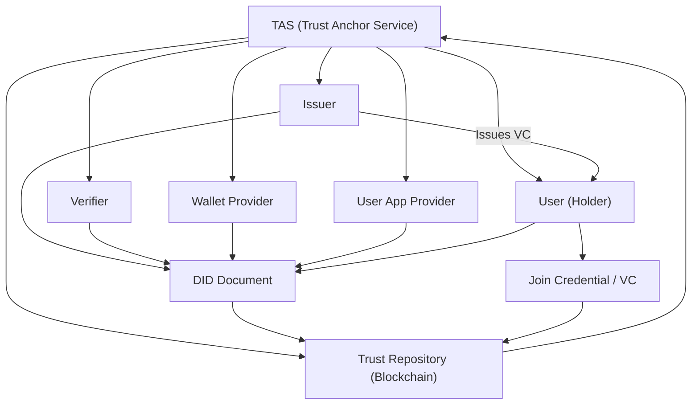

```mermaid
graph TD

    TAS["TAS (Trust Anchor Service)"]
    Issuer["Issuer"]
    Verifier["Verifier"]
    Wallet["Wallet Provider"]
    App["User App Provider"]
    User["User (Holder)"]
    Blockchain["Trust Repository (Blockchain)"]

    DIDDoc["DID Document"]
    Credential["Join Credential / VC"]

    %% 관계 구성
    Blockchain --> TAS
    TAS --> Blockchain

    TAS --> Issuer
    TAS --> Verifier
    TAS --> Wallet
    TAS --> App
    TAS --> User

    Issuer --> DIDDoc
    Verifier --> DIDDoc
    Wallet --> DIDDoc
    App --> DIDDoc
    User --> DIDDoc

    DIDDoc --> Blockchain
    Credential --> Blockchain

    Issuer -->|Issues VC| User
    User --> Credential
```
